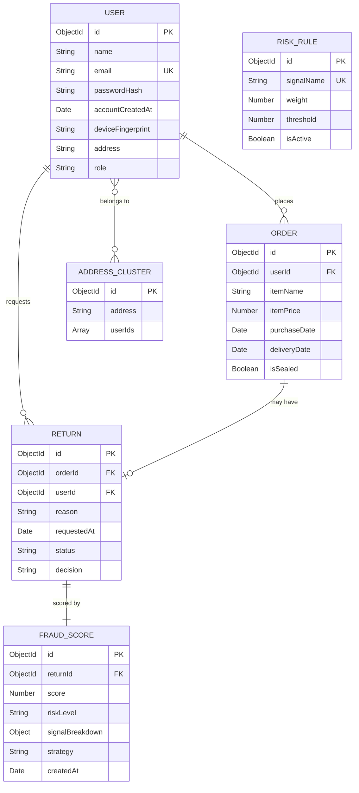

# ER Diagram — Return Fraud Detection System

## Entity Descriptions

| Entity | Purpose | Key Constraints |
|--------|---------|----------------|
| **USER** | Customer and merchant accounts | Email unique; role is customer or merchant |
| **ORDER** | A purchase that can be returned | Linked to one user; isSealed indicates factory-sealed packaging |
| **RETURN** | A return request against a specific order | Status: pending, approved, rejected; decision: auto or manual |
| **FRAUD_SCORE** | Fraud assessment for a single return | Score 0-100; riskLevel: LOW, MEDIUM, HIGH; signalBreakdown stores per-signal scores |
| **RISK_RULE** | Configurable scoring rules | Each rule maps to one of the 7 fraud signals; isActive allows toggling |
| **ADDRESS_CLUSTER** | Groups users sharing the same address | Used by ClusterService to detect potential fraud rings |

## Relationships

| Relationship | Cardinality | Description |
|-------------|-------------|-------------|
| USER to ORDER | One-to-Many | A user can place multiple orders |
| USER to RETURN | One-to-Many | A user can submit multiple returns |
| ORDER to RETURN | One-to-One optional | An order can have at most one return |
| RETURN to FRAUD_SCORE | One-to-One | Every return receives exactly one fraud score |
| USER to ADDRESS_CLUSTER | Many-to-Many | Multiple users can share an address |
