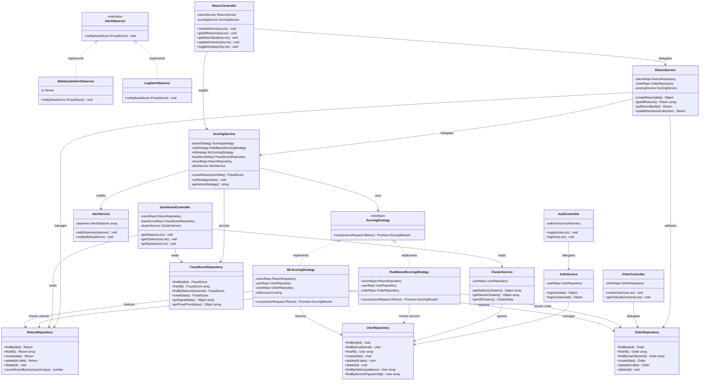

# Class Diagram — Return Fraud Detection System

## Design Patterns Summary

| Pattern | Interface | Concrete Classes | Purpose |
|---------|-----------|-----------------|---------|
| Strategy | ScoringStrategy | RuleBasedScoringStrategy, MLScoringStrategy | Swappable fraud scoring algorithms |
| Observer | AlertObserver | WebSocketAlertObserver, LogAlertObserver | Decoupled real-time alerting on HIGH risk |
| Repository | — | UserRepository, OrderRepository, ReturnRepository, FraudScoreRepository | Isolated data access layer |
