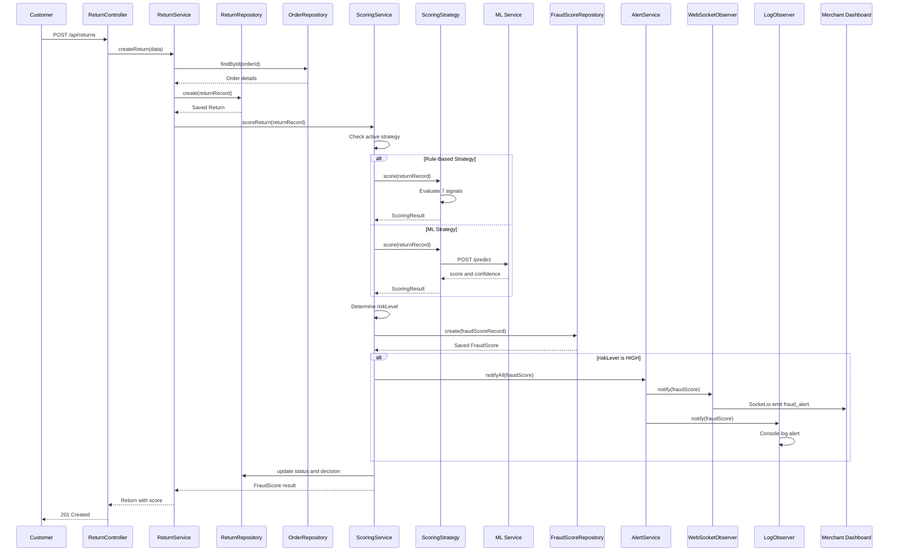
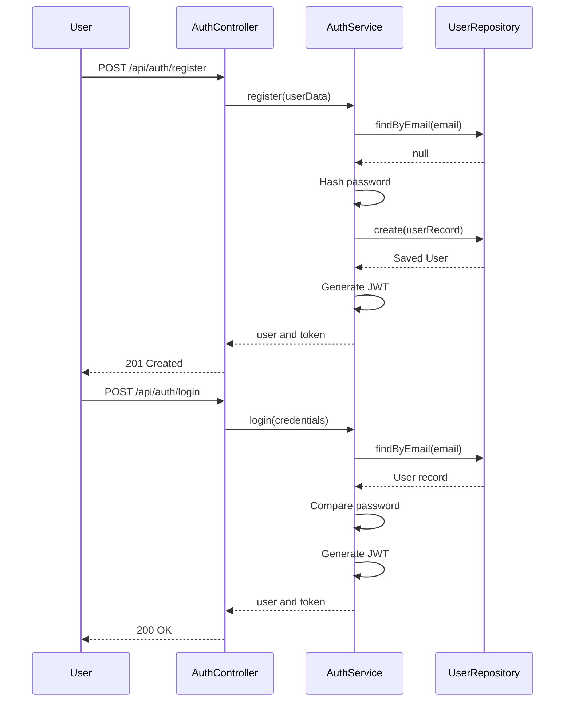
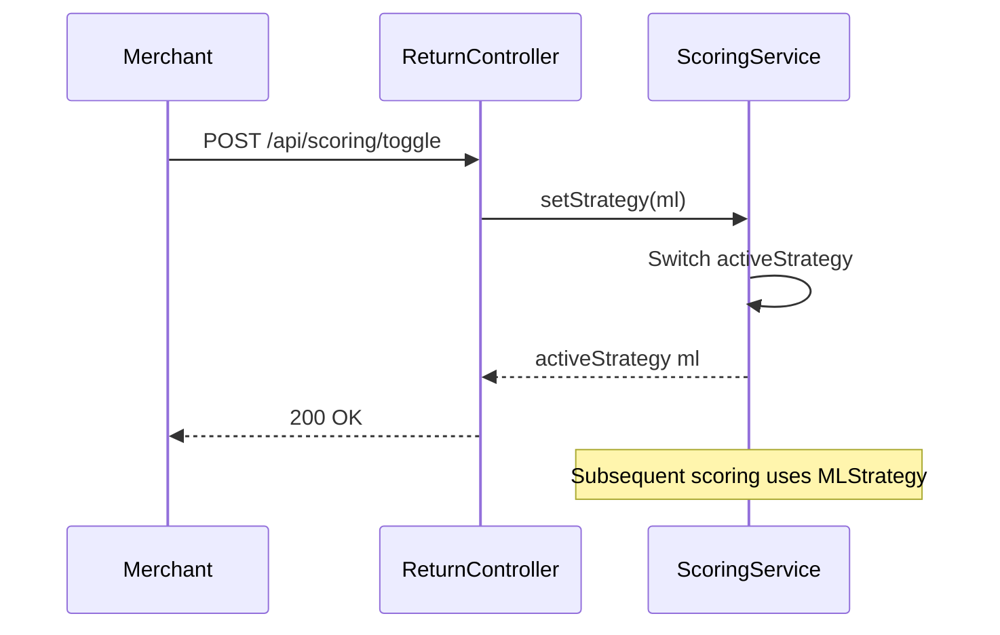

# Sequence Diagram — Return Fraud Detection System

## Main Flow: Submit Return, Score, Alert

```mermaid
sequenceDiagram
    participant C as Customer
    participant RC as ReturnController
    participant RS as ReturnService
    participant RRepo as ReturnRepository
    participant ORepo as OrderRepository
    participant SS as ScoringService
    participant Strat as ScoringStrategy
    participant ML as ML Service
    participant FSRepo as FraudScoreRepository
    participant AS as AlertService
    participant WS as WebSocketObserver
    participant Log as LogObserver
    participant M as Merchant Dashboard

    C->>RC: POST /api/returns
    RC->>RS: createReturn(data)
    RS->>ORepo: findById(orderId)
    ORepo-->>RS: Order details
    RS->>RRepo: create(returnRecord)
    RRepo-->>RS: Saved Return
    RS->>SS: scoreReturn(returnRecord)
    SS->>SS: Check active strategy

    alt Rule-Based Strategy
        SS->>Strat: score(returnRecord)
        Strat->>Strat: Evaluate 7 signals
        Strat-->>SS: ScoringResult
    else ML Strategy
        SS->>Strat: score(returnRecord)
        Strat->>ML: POST /predict
        ML-->>Strat: score and confidence
        Strat-->>SS: ScoringResult
    end

    SS->>SS: Determine riskLevel
    SS->>FSRepo: create(fraudScoreRecord)
    FSRepo-->>SS: Saved FraudScore

    alt riskLevel is HIGH
        SS->>AS: notifyAll(fraudScore)
        AS->>WS: notify(fraudScore)
        WS->>M: Socket.io emit fraud_alert
        AS->>Log: notify(fraudScore)
        Log->>Log: Console log alert
    end

    SS->>RRepo: update status and decision
    SS-->>RS: FraudScore result
    RS-->>RC: Return with score
    RC-->>C: 201 Created
```

## Authentication Flow

```mermaid
sequenceDiagram
    participant U as User
    participant AC as AuthController
    participant AS as AuthService
    participant UR as UserRepository

    U->>AC: POST /api/auth/register
    AC->>AS: register(userData)
    AS->>UR: findByEmail(email)
    UR-->>AS: null
    AS->>AS: Hash password
    AS->>UR: create(userRecord)
    UR-->>AS: Saved User
    AS->>AS: Generate JWT
    AS-->>AC: user and token
    AC-->>U: 201 Created

    U->>AC: POST /api/auth/login
    AC->>AS: login(credentials)
    AS->>UR: findByEmail(email)
    UR-->>AS: User record
    AS->>AS: Compare password
    AS->>AS: Generate JWT
    AS-->>AC: user and token
    AC-->>U: 200 OK
```

## Strategy Toggle Flow

```mermaid
sequenceDiagram
    participant M as Merchant
    participant RC as ReturnController
    participant SS as ScoringService

    M->>RC: POST /api/scoring/toggle
    RC->>SS: setStrategy(ml)
    SS->>SS: Switch activeStrategy
    SS-->>RC: activeStrategy ml
    RC-->>M: 200 OK

    Note over SS: Subsequent scoring uses MLStrategy
```
