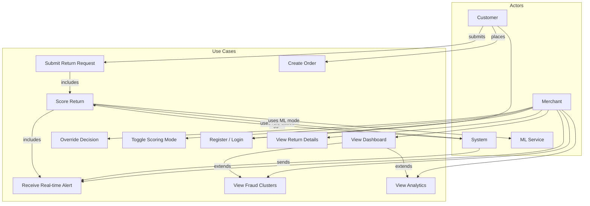

# Use Case Diagram — Return Fraud Detection System

## Actor Descriptions

| Actor | Description |
|-------|-------------|
| **Customer** | End-user who places orders and submits return requests via the API |
| **Merchant** | Business user who monitors returns, reviews flagged cases, and makes override decisions |
| **System** | Automated backend that orchestrates scoring, alerting, and clustering |
| **ML Service** | External Python microservice providing ML-based fraud scoring when toggled on |

## Use Case Details

| Use Case | Primary Actor | Description |
|----------|--------------|-------------|
| Submit Return Request | Customer | Customer submits a return for a previously delivered order |
| Score Return | System | System evaluates the return using the active scoring strategy |
| View Dashboard | Merchant | Merchant views summary stats including total returns, fraud rate, risk distribution |
| Override Decision | Merchant | Merchant manually approves or rejects a return regardless of system recommendation |
| Toggle Scoring Mode | Merchant | Merchant switches between rule-based and ML scoring at runtime |
| Receive Real-time Alert | Merchant | Merchant receives a live WebSocket notification when a HIGH-risk return is detected |
| View Fraud Clusters | Merchant | Merchant views D3 force graph of accounts linked by shared address or device |
| Register / Login | Customer, Merchant | Users authenticate via JWT to access the system |
| View Return Details | Merchant | Merchant views individual return with signal breakdown and weights |
| View Analytics | Merchant | Merchant views signal frequency charts and fraud trend lines |
| Create Order | Customer | Customer places an order which can later be the subject of a return |
